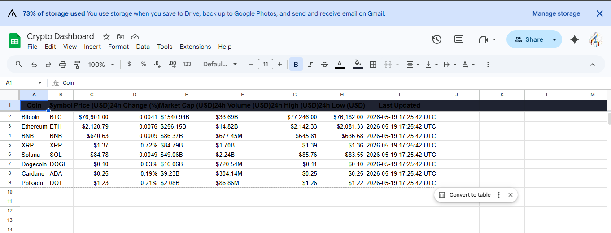
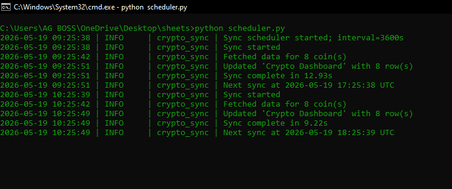

# Crypto Sheets Sync

Small Python script that pulls live crypto prices from CoinGecko and writes them into a Google Sheet. I built it as a lightweight dashboard that can keep updating on a schedule without needing Zapier, Make, or manual copy-paste.

The scheduler runs once when it starts, then runs again every hour by default.

## Demo

Live sheet after a sync:



Terminal run:



## How it works

`fetcher.py` gets the latest market data from CoinGecko.

`sheets.py` logs into Google Sheets with a service account and writes the rows.

`scheduler.py` ties everything together and repeats the sync on an interval.

`config.py` keeps the settings in one place, including the coins being tracked and the sheet columns.

## Setup

Install the packages:

```bash
python -m pip install -r requirements.txt
```

Create a Google Cloud project, then enable:

```text
Google Sheets API
Google Drive API
```

Create a service account, download its JSON key, rename it to `credentials.json`, and put it in the project folder.

Open `credentials.json`, copy the `client_email`, then share your Google Sheet with that email as an Editor.

## Environment

Copy the example env file:

```bash
copy .env.example .env
```

Then fill in your sheet info:

```env
SHEET_NAME=Crypto Dashboard
GOOGLE_SHEET_ID=your_google_sheet_id_here
SYNC_INTERVAL_SECONDS=3600
GOOGLE_CREDENTIALS_FILE=credentials.json
```

The sheet ID comes from the Google Sheets URL:

```text
https://docs.google.com/spreadsheets/d/THIS_PART_IS_THE_ID/edit
```

Using the sheet ID is more reliable than opening the sheet by name.

## Run it

Start the scheduler:

```bash
python scheduler.py
```

For a quick one-time sync:

```bash
python -c "from fetcher import fetch_crypto_prices; from sheets import write_to_sheet; write_to_sheet(fetch_crypto_prices())"
```

## Tests

```bash
python -m pytest -q
```

## Notes

These files are local only and should not be pushed:

```text
.env
credentials.json
sync.log
__pycache__/
.pytest_cache/
```

The tracked coins are listed in `config.py`. Add or remove CoinGecko coin IDs there if you want a different dashboard.
